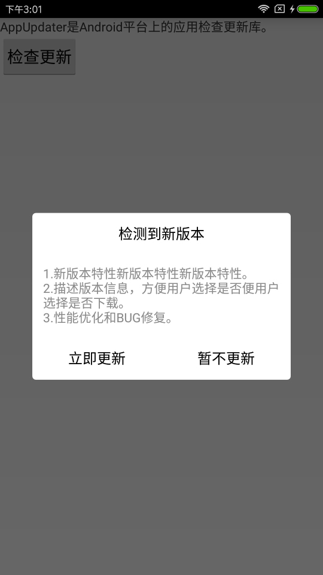
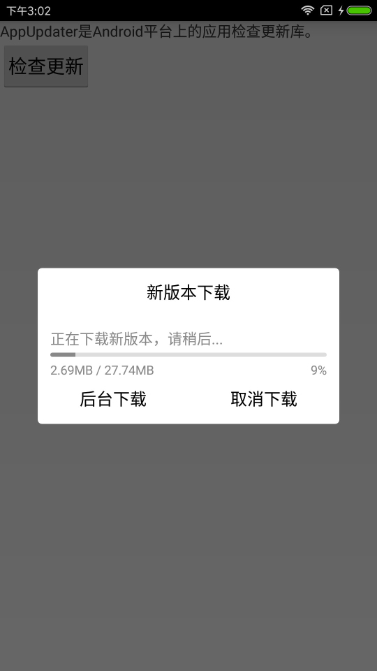
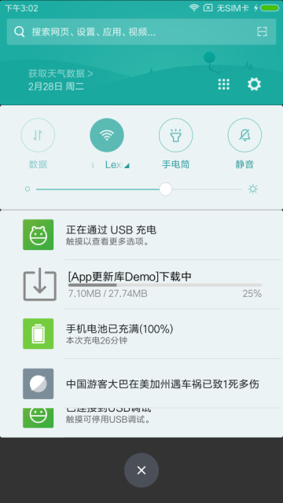

# AppUpdater
  由于各大应用市场相继拒绝上线集成友盟等第三方自动更新功能的应用，友盟已放弃维护和支持自动更新功能模块。但这个功能对很多App还是很重要的，考虑到这个功能的必要性和通用性，于是这个项目就这么诞生了。使用这个项目，你可以一句代码实现Android应用自身检查更新。

## 功能特点
* 使用简单，只需一句代码即可；
* 不依赖第三方库；
* 界面美观；

## 效果截图




## 如何使用
1.首先，添加jitpack支持，修改项目根目录下的build.gradle：
```gradle
allprojects {
		repositories {
			...
			maven { url 'https://jitpack.io' }
		}
	}
```
2.接着，添加gradle依赖，修改项目模块目录下的build.gradle：
```gradle
dependencies {
	...
	compile 'com.github.JebySun:AppUpdater:v1.0.0'
}
```
3.然后，在合适的位置（通常是Activity的onCreate方法内）加入以下一句代码即可：
```java
// 自动检查更新
AppUpdater.with(this).setHostUpdateCheckUrl("http://files.cnblogs.com/files/jebysun/app_version.js").check();
```
4.最后，在服务器放一个json规范格式的文件，该文件的url地址就是java代码中setHostUpdateCheckUrl方法的参数，文件内容如下：
```javascript
{
	"versionCode":10,
	"versionName":"1.0.0",
	"fileSize":"6.2M",
	"apkUrl":"http://58.216.107.44/imtt.dd.qq.com/16891/36C5694F6FE468D788FFFC65166547BE.apk?mkey=58a403869c7c4c41&f=858&c=0&fsname=com.qiyi.video_8.1_80830.apk&csr=4d5s&p=.apk",
	"required":false,
	"releaseDate":"2017-02-12 12:45:20",
	"releaseNotes":["1.新版本特性新版本特性新版本特性。", "2.描述版本信息，方便用户选择是否便用户选择是否下载。", "3.性能优化和BUG修复。"]
}
```
做完以上工作之后，运行吧。
另外，如果需要手动检查更新，就这样写：
```java
Button btnCheckUpdate = (Button) this.findViewById(R.id.btn_check_update);
btnCheckUpdate.setOnClickListener(new View.OnClickListener() {
	@Override
	public void onClick(View view) {
		checkNewVersion();
	}
});

/**
 * 手动检查更新
 */
private void checkNewVersion() {
	// 提示用户正在检查更新
	mProgressDialog = new ProgressDialog(this);
	mProgressDialog.show();
	
	AppUpdater.with(this)
			// 手动强制检查更新
			.setForceMode(true)
			.setHostUpdateCheckUrl("http://files.cnblogs.com/files/jebysun/app_version.js")
			// 检查结果回调
			.setOnUpdateCheckResultListener(new OnUpdateCheckResultListener() {
				@Override
				public void onSuccess(boolean hasNew) {
					// 关闭提示
					mProgressDialog.dismiss();
					if (!hasNew) {
						Toast.makeText(MainActivity.this, "你已经安装最新版本", Toast.LENGTH_SHORT).show();
					}
				}

				@Override
				public void onError(String msg) {
					// 关闭提示
					mProgressDialog.dismiss();
					Toast.makeText(MainActivity.this, msg, Toast.LENGTH_SHORT).show();
				}
			})
			.check();
}
```
如果按照以上说明你没成功，请参考项目app模块的使用示例吧。

## 反馈联系
* jebysun(a)126.com

## License
Copyright 2017 JebySun

Licensed under the Apache License, Version 2.0 (the "License");
you may not use this file except in compliance with the License.
You may obtain a copy of the License at

   http://www.apache.org/licenses/LICENSE-2.0

Unless required by applicable law or agreed to in writing, software
distributed under the License is distributed on an "AS IS" BASIS,
WITHOUT WARRANTIES OR CONDITIONS OF ANY KIND, either express or implied.
See the License for the specific language governing permissions and
limitations under the License.

